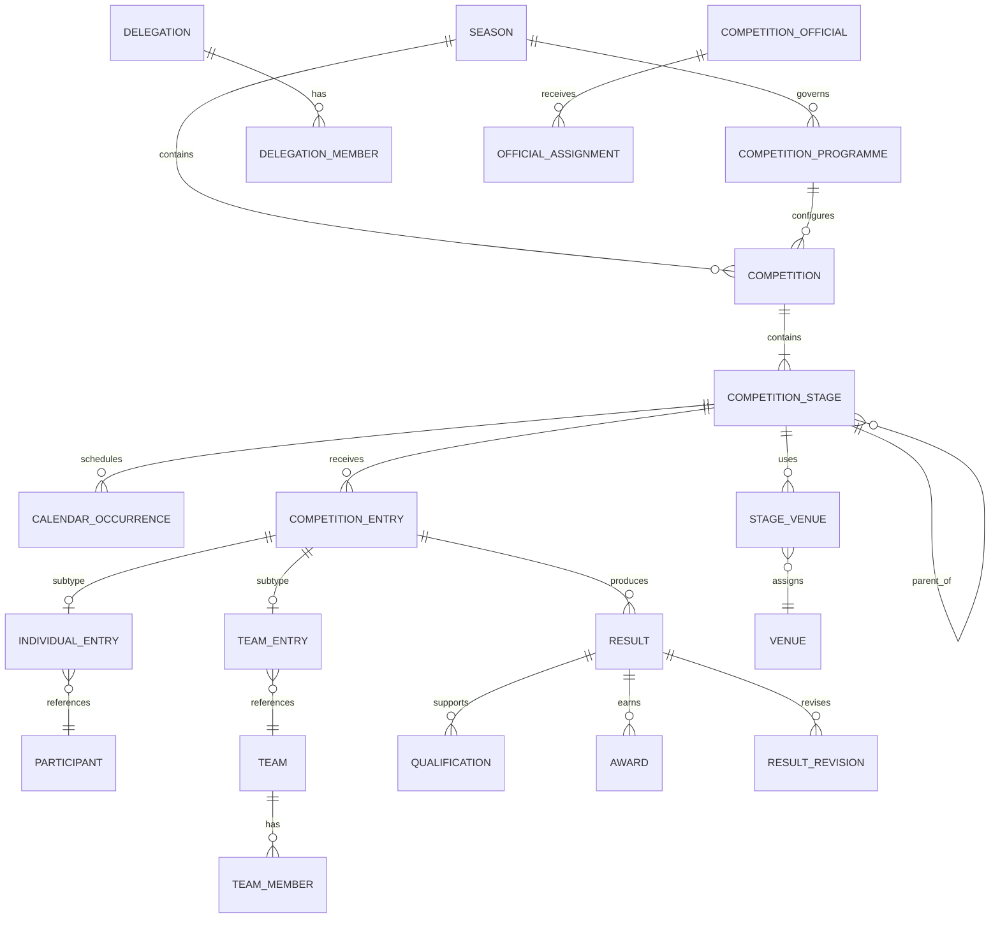
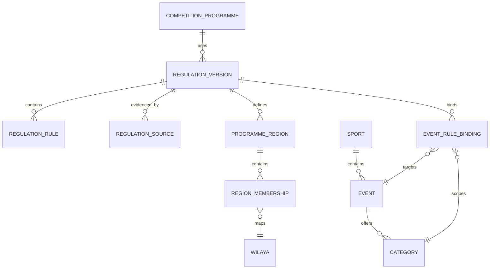
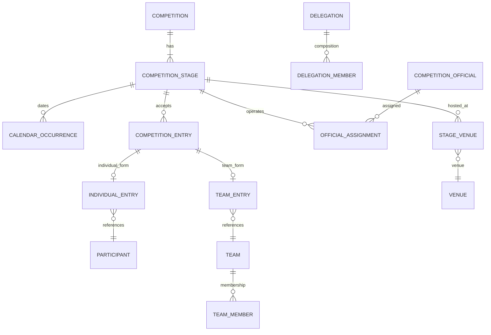
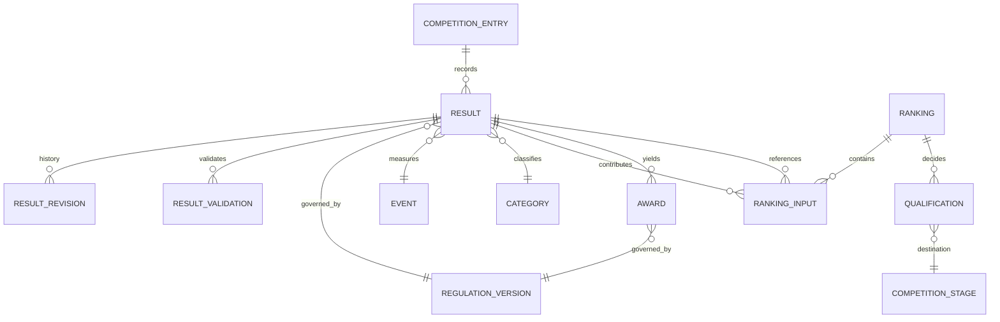

# NSSMS Competition Domain — Logical Data Model

**Status:** Logical analysis only — approval required  
**Task:** `NSSMS-ARCH-004`  
**Scope:** No SQL, migrations, application code, API implementation, or schema change.

## 1. Purpose and evidence boundary

This model extends the current NSSMS logical model (seasons, competitions, organizations, institutions, participants, licenses, results, and audit events) using the approved ARCH-002 competition analysis and ARCH-003 versioned-regulations ADR. The official references confirm a 2025/2026 staged programme, sport/event/category variation, individual and team participation, qualification, results, rankings, awards, and calendar windows; the 2021/2022 BILAN supplies operational historical evidence.

Rules remain versioned configuration. Season-specific or sport-specific values are not global constants. Proposed entities below are conceptual and are not implementation instructions.

## 2. Modeling decisions

1. **Competition is a governed container.** It belongs to a season and programme and may contain one or more stage occurrences. A `CompetitionStage` represents the dated geographic/operational occurrence; Competition is not duplicated for every level.
2. **Stages reference reusable event definitions.** `Event` and `Category` are reusable definitions scoped by regulation/programme; a stage schedules applicable events through occurrence/configuration links.
3. **Stage hierarchy is data-driven.** A stage has a regulation-defined level code and optional parent stage; no global enum is authoritative.
4. **Region identity is explicit and versioned.** `ProgrammeRegion` identifies a region within a programme/regulation version; `RegionMembership` maps it to wilayas. A free-standing region string is not authoritative.
5. **Entries use explicit subtypes.** `CompetitionEntry` has exactly one `IndividualEntry` or `TeamEntry` subtype; no participant/team nullable pair is the final logical design.
6. **Qualification is a decision record.** It links source entry/result/ranking to a destination stage and, when created, a destination entry.
7. **Results retain governing versions.** Every official result stores or immutably references the regulation, event/category, and provenance context used to produce it.
8. **Rankings may be materialized projections.** Raw results are authoritative; a published ranking is stored as a versioned/validated projection with its calculation context.
9. **Awards are separate decisions.** Medals, points, trophies, and certificates are not inferred solely from a mutable rank.
10. **Corrections append history.** Result revisions and validation history preserve prior official states.

## 3. Entity classification

| Entity/concept | Classification |
|---|---|
| Season, Competition, Organization, EducationalInstitution, Participant, SportsLicense, Result, AuditEvent | SYSTEM-DOMAIN EXISTING |
| CompetitionProgramme, CompetitionStage, Sport, Event, Category, CalendarOccurrence, CompetitionEntry, IndividualEntry, TeamEntry, Team, TeamMember, Delegation, DelegationMember, CompetitionOfficial, OfficialAssignment, Venue, StageVenue/StageEventOccurrence | NEW CORE ENTITY (conceptual) |
| RegulationVersion, RegulationRule/RuleSet, RegulationSource, ProgrammeRegion, RegionMembership, EventRuleBinding | NEW CONFIGURATION ENTITY |
| Qualification, Ranking, RankingInput, Award, ResultRevision, ResultValidation | NEW HISTORICAL/DECISION ENTITY |
| VenueInspection, Appeal, Substitution, EntryDocument, TechnicalRecord | OPTIONAL/FUTURE ENTITY |

## 4. Proposed entity definitions

The following definitions apply to every proposed entity. “Ownership” means the accountable domain authority, not a new application role. Administrative scope follows the ARCH-001 hierarchy: national, association/wilaya, daira, or institution.

### 4.1 Configuration and regulation entities

| Entity | Purpose and identity | Ownership/lifecycle | Key attributes and relationships | Cardinality, uniqueness, nullability | Historical/versioning, scope, audit |
|---|---|---|---|---|---|
| CompetitionProgramme | Approved programme for a season; identity is a stable programme id plus version context. | Programme/national authority; draft → approved → active → retired. | season, title, programme code, governing RegulationVersion. | One season may have many programmes; code unique within authority/season; dates and regulation FK non-null once approved. | Immutable after publication; source/provenance and full audit. National or programme scope. |
| RegulationVersion | Immutable applicable rule bundle. | Regulation owner; draft → approved → active → retired. | version number, parent/derived version, scope dimensions, effective interval, status. | No overlapping active versions at identical scope; parent optional; effective dates required for approved versions. | Exact version referenced by decisions/results; activation/retirement audited. Scope is explicit. |
| RegulationRule / RuleSet | A named rule value or formula within a regulation version. | Regulation owner; only editable in draft. | rule key, typed value/formula, unit, precedence, override target, validation metadata. | Rule key unique within version/scope; value nullable only when rule explicitly means “not specified.” | Never mutate active values; override chain and audit retained. |
| RegulationSource | Official document provenance. | Regulation owner; retained permanently. | title, issuer, identifier, issue date, page/section, hash/archive reference, evidence class. | A version has one or more sources; source identifier/hash unique where available. | Immutable provenance; access audited. |
| ProgrammeRegion | Explicit region identity/code/name within a programme/regulation version. | National/programme authority; draft → approved → active → retired. | region code/name, programme, governing RegulationVersion, effective interval. | Code unique within programme/version; historical identity is never silently renamed. | Versioned identity retained for historical stages; national/programme scope and full audit. |
| RegionMembership | Programme-versioned mapping from ProgrammeRegion to wilaya. | National/programme authority. | programme region, wilaya id, programme/regulation version, effective interval. | A wilaya belongs to at most one region within a programme version unless an explicit transition exists. | Historical membership retained; scope national/programme. |
| EventRuleBinding | Applies a regulation rule set to an event/category/stage. | Discipline/programme authority. | event, category, stage scope, regulation version, override precedence. | One effective binding per rule key and scope. | Resolution trace retained for official outcomes. |

### 4.2 Competition operation entities

| Entity | Purpose and identity | Ownership/lifecycle | Key attributes and relationships | Cardinality, uniqueness, nullability | Historical/versioning, scope, audit |
|---|---|---|---|---|---|
| CompetitionStage | Dated institution/commune/daira/wilaya/region/national occurrence; identity is stage id. | Stage operator; draft → scheduled → active → results → closed/archived. | competition, level code, parent stage, programme/regulation version, host, venue, dates. | Competition has one or more stages; parent optional only for root; level and regulation non-null. | Published stage metadata immutable after start except audited correction. Scope follows stage geography. |
| Sport | Reusable discipline reference. | Discipline authority; active/retired. | code, name, sport type. | Code globally unique within approved vocabulary. | Version changes use new code/version or effective reference; not silent rename. |
| Event | Reusable contest definition. | Discipline authority; draft → approved → retired. | sport, code, format, measurement type, rule binding. | Event code unique within sport/version; sport non-null. | Technical definition versioned through regulation binding. |
| Category | Age/gender/education/technical cohort. | Programme/discipline authority. | code, gender dimension, age/birth-year rule reference, technical class. | Code unique within programme/rule version; dimensions explicit, not inferred. | Rule version and effective interval required. |
| CalendarOccurrence | Published date/window for a stage/event. | Programme/stage authority; draft → approved → published → completed. | stage, event/category, start/end, registration deadlines, source. | No conflicting occurrences for same stage/event/category; dates non-null when published. | Source and regulation version retained. |
| CompetitionEntry | Governed common participation record. | Institution/stage authority; draft → submitted → validated → withdrawn/disqualified. | stage, category, status, institution/representing authority, regulation context, validation/audit data. | Exactly one `IndividualEntry` XOR `TeamEntry`; no participant_id/team_id nullable pair as final design. | Common record is retained; subtype and validation history are immutable after official use. Scope institution through stage. |
| IndividualEntry | Mutually exclusive entry subtype for one participant. | Institution/stage authority; follows CompetitionEntry lifecycle. | competition entry, participant. | Exactly one participant per individual entry; participant cannot have duplicate active entry in same stage/category. | Regulation and eligibility context inherited from common entry; audited. |
| TeamEntry | Mutually exclusive entry subtype for one team. | Institution/stage authority; follows CompetitionEntry lifecycle. | competition entry, team. | Exactly one team per team entry; team/category/stage compatibility enforced. | Membership and regulation context retained; audited. |
| Team | Named collective unit. | Institution/association; draft → submitted → active → completed. | institution/representing unit, name, category, stage/competition context. | Name unique within stage/category/representing institution; ownership non-null. | Membership changes audited; team identity not reused across incompatible categories. |
| TeamMember | Explicit team-athlete membership. | Team owner; proposed → confirmed → ended. | team, participant, role (athlete/reserve), join/leave, entry. | Participant cannot be active twice in same team/category; role controlled by regulation. | Membership history retained; substitution is append-only decision data. |
| Delegation | Group travelling/representing an institution or qualified unit. | Delegating authority; draft → approved → active → closed. | stage, representing unit, head, scope, accreditation reference. | One delegation may cover a stage; composition rules come from regulation. | Members and role changes audited; event-specific composition is versioned. |
| DelegationMember | Person-role membership in delegation. | Delegation owner. | delegation, person, role (athlete/coach/head/official/support), dates. | Role and person unique within delegation interval. | Retain historical composition and approvals. |
| CompetitionOfficial | Person qualified/appointed for event operations. | Technical authority; proposed → approved → retired. | person, official type, accreditation/provenance. | Accreditation uniqueness depends on authority and validity interval. | Appointment and accreditation evidence retained. |
| OfficialAssignment | Assignment of official to stage/event. | Competition technical authority; draft → assigned → completed. | official, stage/event, function, dates. | No conflicting assignment for same function/time unless regulation permits. | Assignment and sign-off audited. |
| Venue | Location used by an occurrence. | Host authority; proposed → approved → retired. | geography, facility, capacity/technical attributes. | Facility identifier unique within authority. | Inspection/source history retained where available. |
| StageVenue / StageEventOccurrence | Associates a stage/event occurrence with one or more venues and times. | Stage/host authority; draft → approved → completed. | stage, event/category occurrence, venue, start/end, hosting data. | Stage may have N:M venues; event/time combinations are explicit. | Historical venue/time assignment retained and audited. |

### 4.3 Results, decisions, and history entities

| Entity | Purpose and identity | Ownership/lifecycle | Key attributes and relationships | Cardinality, uniqueness, nullability | Historical/versioning, scope, audit |
|---|---|---|---|---|---|
| Qualification | Explicit progression decision. | Stage/technical authority; draft → approved → applied → superseded. | source entry/result/ranking, destination stage/entry, decision reason, quota/rule version. | At least one source and destination stage; destination entry may be pending; no duplicate active decision. | Immutable decision with regulation/provenance; corrections supersede. |
| Result | Raw or official performance for entry/event. Existing concept retained. | Event official; draft → submitted → validated → published → superseded. | entry, event/category, value/unit/placing, status, regulation/event-rule references. | One official result per entry/event/attempt as permitted by rule; sport-specific payload may be JSON only for extensible measurements. | Exact rule version, source, and validation history required for official status. |
| Ranking | Ordered projection for event/stage/category or aggregate. | Technical authority; calculated → reviewed → published → superseded. | scope, ordering, formula/rule version, immutable input set. | One published ranking per scope/version; tie representation explicit. A ranking has N `RankingInput` rows. | Recomputable from retained inputs; publication immutable. |
| RankingInput | Immutable membership of a result/aggregate input in a ranking. | Technical authority; created with ranking. | ranking, result (or approved aggregate source), input order/weight. | A result may contribute to many rankings; no duplicate result/input role within one ranking. | Exact input set is retained for reproducibility. |
| Award | Medal/points/trophy/certificate decision. | Awarding authority; proposed → approved → published → superseded. | recipient/result/ranking, award type, points, rule version. | Unique award per recipient/scope/type unless regulation allows multiples. | Source and decision audit retained. |
| ResultRevision / ResultValidation | Append-only correction and validation history. | Authorized official/authority; recorded → approved/rejected. | result, prior snapshot/hash, new snapshot, reason, actor, timestamp, decision. | Every revision references exactly one prior state; no destructive overwrite. | Required for official corrections; audit and provenance immutable. |

## 5. Relationship matrix

| From | Relationship | To | Cardinality / rule |
|---|---|---|---|
| Season | contains | CompetitionProgramme | 1:N |
| Season | contains | Competition | 1:N; existing relationship retained |
| CompetitionProgramme | governs | Competition | 1:N |
| Competition | contains | CompetitionStage | 1:N |
| CompetitionStage | has parent | CompetitionStage | 0:1 parent; N children |
| Programme/RegulationVersion | defines | Stage/Sport/Event/Category rules | 1:N |
| CompetitionProgramme | defines | ProgrammeRegion | 1:N |
| ProgrammeRegion | contains | RegionMembership | 1:N |
| RegionMembership | maps | Wilaya | N:1 within a programme version |
| CompetitionStage | schedules | CalendarOccurrence | 1:N |
| CompetitionStage | offers | Event/Category | N:M through occurrence/binding |
| CompetitionStage | receives | CompetitionEntry | 1:N |
| CompetitionEntry | has exactly one subtype | IndividualEntry XOR TeamEntry | mutually exclusive |
| IndividualEntry | references | Participant | exactly 1 |
| TeamEntry | references | Team | exactly 1 |
| Team | has | TeamMember | 1:N |
| Delegation | has | DelegationMember | 1:N |
| CompetitionOfficial | receives | OfficialAssignment | 1:N |
| CompetitionStage | uses through StageVenue/StageEventOccurrence | Venue | potentially N:M; event/time-specific |
| CompetitionEntry/Event | produces | Result | 1:N attempts; 1 official result where applicable |
| Result/Ranking | supports | Qualification | 0:N |
| Qualification | targets | CompetitionStage/Entry | 1 destination stage; entry may be created later |
| Result | contributes through RankingInput to | Ranking | N:M; one result may feed multiple rankings |
| Result/Ranking | grants | Award | 0:N |
| Result | has | ResultRevision/Validation | 1:N append-only |

## 6. Invariants and data-integrity rules

1. Every competition belongs to a valid season and approved programme context.
2. Every official stage, entry, result, qualification, ranking, and award references an active or historical regulation version appropriate to its effective date.
3. A stage level, region membership, quota, category, team size, weight, distance, and formula are resolved from versioned rules; no undocumented default is permitted.
4. A `CompetitionEntry` MUST have exactly one subtype: `IndividualEntry XOR TeamEntry`; `participant_id/team_id` nullable-pair polymorphism is not the final logical design.
5. A qualification cannot target a stage incompatible with the source stage, category, sport, or approved progression rules.
6. Published results, rankings, awards, and regulation versions are immutable; corrections append revisions.
7. A ranking is reproducible from its retained result inputs and rule version.
8. A result cannot be officially validated without an assigned event official or approved validation authority where the regulation requires one.
9. A `ProgrammeRegion` has explicit versioned identity; its `RegionMembership` rows are unique within a programme version and never retroactively change historical stages.
10. A stage may use multiple venues, and event/time-specific venue assignments are explicit.
11. A ranking retains an immutable `RankingInput` set; one result may contribute to multiple rankings.
12. Governed records are not physically deleted through normal business operations.

## 7. Versioning and provenance rules

- Regulations are versioned configuration, not hard-coded global business rules.
- Published regulation versions are immutable.
- New seasons may reuse, copy, or derive prior rules, but every change creates a new version.
- Sport-specific rules override broader programme rules only through explicit approved bindings.
- Historical decisions retain the exact regulation, event/category, and source provenance used.
- Official source metadata includes title, issuer, identifier, issue date, page/section, and hash/archive reference where available.
- Legacy records without known provenance remain readable but are marked unresolved; current rules are not inferred retroactively.

## 8. Scope and authorization implications

Authorization applies to both the actor permission and the domain scope. ARCH-001 currently defines national, association/wilaya, daira, and institution scopes. National users may manage national/programme rules; wilaya/association users are restricted to assigned wilaya/organization; daira users to their daira and subordinate data; institution users to their institution and subordinate entries/participants. Direct IDs for stages, entries, teams, delegations, results, rankings, awards, or regulation versions must be checked against the resolved administrative scope. Cross-scope reads and writes return the established 401/403 behavior from ARCH-001.

### AUTHORIZATION MODEL GAP

ARCH-002/ARCH-004 introduces commune competition stages and regional competition stages, but the existing authorization architecture does not yet define first-class **COMMUNE** or **REGION** administrative scopes. This is a known gap, not an implied authorization grant.

Possible future approaches (not selected here):

1. Inherit stage authorization from the governing organization/daira/wilaya.
2. Introduce explicit commune and region scope types.
3. Adopt a generic governed-scope model that maps users and entities to versioned administrative boundaries.

The final choice remains **OPEN** for a later architecture decision. Until then, commune/region stages must be protected through an explicitly approved parent-scope policy and must not be assumed accessible merely because a stage exists.

## 9. Current-model gaps

The existing logical model does not explicitly represent programmes, stages, sport/event/category definitions, calendar occurrences, entries, teams/memberships, delegations, officials/assignments, venues, qualifications, rankings, awards, regulation versions/rules/sources, region membership versions, or append-only result revisions. Existing `results.result_data` does not guarantee structured ranking, qualification, or provenance semantics.

## 10. Migration implications — analysis only

No SQL or migration is proposed. A future migration should inventory current competitions/results, preserve all existing JSON payloads, assign a known regulation reference when evidence exists, mark unknown provenance explicitly, introduce references additively, and validate old workflows before enforcing new non-null governance links.

### Existing competition/result compatibility

Current NSSMS `Competition` records already carry lifecycle/date semantics. Current `Result` rows belong directly to `Competition` and may optionally reference `Participant`. In the future model, Competition is the container and `CompetitionStage`/Event/Entry provide operational context. Existing records remain readable; legacy competition dates may initially map to a default/imported stage only when evidence supports that mapping. Existing results are preserved unchanged. Results without Entry/Event/Regulation context are marked **unresolved** rather than fabricated or silently assigned current rules.

## 11. Performance and indexing considerations — analysis only

Future physical design should index regulation scope/effective dates, stage parent and geography, entry subject/category, result event/entry/status, qualification source/destination, ranking publication scope, and audit timestamps. Resolution queries should avoid unbounded inheritance walks; published versions may use cached/materialized resolution snapshots while retaining source rule identity. These are analysis considerations, not schema instructions.

## 12. High-level domain relationship diagram

## 13. Regulation/configuration submodel

## 14. Competition operations submodel

## 15. Result/qualification/history submodel

## 16. Open questions

1. Which concrete regulation scopes and approval authorities are permitted in the first implementation slice?
2. Should rankings be fully materialized, derived on demand, or hybrid by sport/scale?
3. What exact sport-specific payloads require JSON extensions after the relational minimum is defined?
4. How should unresolved legacy result provenance be reviewed and approved?
5. Which venue, official accreditation, appeal, and substitution concepts are mandatory rather than optional?
6. What canonical identifiers and vocabulary governance will be used for sports, events, categories, and stage levels?

## 17. Recommended implementation order

1. Approve vocabulary, authority matrix, and regulation-version lifecycle.
2. Implement regulation source/version/rule resolution and audit foundation.
3. Add programme, stage, sport/event/category, and calendar concepts.
4. Add explicit entries, teams, memberships, delegations, officials, and venues.
5. Add qualification, result validation/revision, ranking, and award decisions.
6. Migrate legacy result references conservatively and add cross-scope regression tests.

## 18. Decision boundary

This document is a logical model only. It does not select SQL tables, create migrations, change current entities, or authorize implementation. ARCH-005 is not started by this document.
